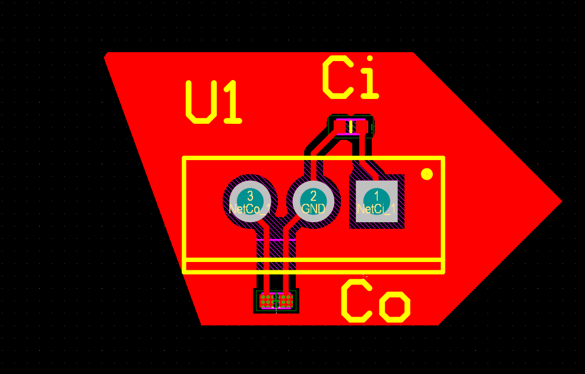

# LM7805 Voltage Regulator PCB Design

## Overview
This project demonstrates a basic 5V linear voltage regulator circuit using LM7805, including input/output filtering capacitors.

## Features
- 5V regulated output
- Input/output decoupling capacitors
- Simple PCB layout design

## Picture

